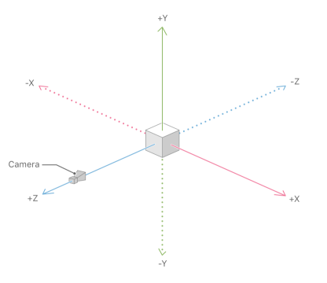

# Intro to [ARKit](https://developer.apple.com/documentation/arkit)

## Tools
- ARKit
- SceneKit

## Core Classes

**ARSCNView**:
The `ARSCNView` class provides the easiest way to create augmented reality experiences that blend virtual 3D content with a device camera view of the real world. When you run the view's provided ARSession object:
The view automatically renders the live video feed from the device camera as the scene background.
The world coordinate system of the view's SceneKit scene directly responds to the AR world coordinate system established by the session configuration.
The view automatically moves its SceneKit camera to match the real-world movement of the device.
Because ARKit automatically matches SceneKit space to the real world, placing a virtual object such that it appears to maintain a real-world position requires only setting that object's SceneKit position appropriately.

**ARSession**:
A shared object that manages the device camera and motion processing needed for augmented reality experiences.
An ARSession object coordinates the major processes that ARKit performs on your behalf to create an augmented reality experience. These processes include reading data from the device's motion sensing hardware, controlling the device's built-in camera, and performing image analysis on captured camera images. The session synthesizes all of these results to establish a correspondence between the real-world space the device inhabits and a virtual space where you model AR content.
Every AR experience built with ARKit requires a single ARSession object. If you use an ARSCNView or ARSKView object to easily build the visual part of your AR experience, the view object includes an ARSession instance. If you build your own renderer for AR content, you'll need to instantiate and maintain an ARSession object yourself.

**ARWorldTrackingConfiguration**:
A configuration that uses the rear-facing camera, tracks a device's orientation and position, and detects real-world flat surfaces.
All AR configurations establish a correspondence between the real world the device inhabits and a virtual 3D coordinate space where you can model content. When your app displays that content together with a live camera image, the user experiences the illusion that your virtual content is part of the real world.
Creating and maintaining this correspondence between spaces requires tracking the device's motion. The ARWorldTrackingConfiguration class tracks the device's movement with six degrees of freedom (6DOF): specifically, the three rotation axes (roll, pitch, and yaw), and three translation axes (movement in x, y, and z).

## Initializing the Session

Inside the `viewWillAppear()` method, we'll initialize the `ARSession` instance:

```swift
override func viewWillAppear(_ animated: Bool) {
    super.viewWillAppear(animated)
    setupSession()
}

func setupSession() {
    // Create a session configuration
    let configuration = ARWorldTrackingConfiguration()
    
    // Specify that we want to track horizontal planes. Setting this will cause
    // the ARSCNViewDelegate methods to be called when planes are detected!
    configuration.planeDetection = .horizontal
    
    // Run the view's session
    sceneView.session.run(configuration)
}
```

We'll load a predefined scene from our `art.scnassets` folder and add a cube to it. In the `viewDidLoad()` method:

```swift
override func viewDidLoad() {
    super.viewDidLoad()
    setupScene()
}

func setupScene() {
    // Setup the ARSCNViewDelegate - this gives us callbacks to handle new
    // geometry creation
    self.sceneView.delegate = self
    
    // Adds default lighting to scene
    self.sceneView.autoenablesDefaultLighting = true
    
    // Show statistics such as fps and timing information
    self.sceneView.showsStatistics = true
    
    // Show debug information for feature tracking
    self.sceneView.debugOptions = [ARSCNDebugOptions.showWorldOrigin, ARSCNDebugOptions.showFeaturePoints]
    
    // Create a new scene by loading it from scene assets
    let scene = SCNScene(named: "art.scnassets/ship.scn")!
    
    // Define a box geometry
    let boxGeometry = SCNBox(width: 0.1, height: 0.1, length: 0.1, chamferRadius: 0.0)
    
    // Create the node for the scene
    boxNode = SCNNode(geometry: boxGeometry)
    
    // Position it as desired
    boxNode.position = SCNVector3Make(0, 0.25, -0.5)
    
    // Attach to scene's root node
    scene.rootNode.addChildNode(boxNode)
    
    // Set the scene to the view
    self.sceneView.scene = scene
    sceneView.isPlaying = true
}
```

## Animation



Note that all units are in meters! We should now see a plane (as defined in our scene assets), and a cube above it. Let's try animating the cube by rotating it.

To do this, we need to subscribe to the `SCNSceneRendererDelegate` in the `ViewController` definition:

```swift
class ViewController: UIViewController, ARSCNViewDelegate, SCNSceneRendererDelegate { ...
```

And define the delegate method (the main render loop) inside our controller:

```swift
func renderer(_ renderer: SCNSceneRenderer, updateAtTime time: TimeInterval) {
    let rotValue = Float(time).truncatingRemainder(dividingBy: Float.pi)
    boxNode.rotation = SCNVector4Make(rotValue, 1.0, 1.0, Float.pi)
}
```

## Plane Detection & Visualization

We will now extract 3D geometry from the real world and visualize it. The first step to getting a geometrical understanding of the world via the camera input is to detect horizontal planes. Once we detect it, we can visualize it to show the scale and orientation of the plane.

From a high level perspective, ARKit extracts features from the camera feed and tracks it across multiple frames. It takes these corresponding points and estimates 3D pose information, such as the current camera position and the positions of the features. As the user moves around more, we get more and more features and the 3D pose estimations improve.

For plane detection, once we have a number of feature points in 3D, we can then try to fit planes to those points and find the best match in terms of scale, orientation and position. ARKit is constantly analyzing these feature points and reporting all planes it finds back to us in the code.

We need to make sure that we're generating features for it to detect, and that means we need good lighting, interesting texture, and slow movement. Before we start, let's add some debugging information to the app so we can tell how well the tracking system is working:

```swift
// Show debug information for feature tracking
sceneView.debugOptions = [ARSCNDebugOptions.showWorldOrigin, ARSCNDebugOptions.showFeaturePoints]
```

We'll create a `Plane` class to render our plane:

```swift
import ARKit
import SceneKit

class Plane: SCNNode
{
    var anchor: ARPlaneAnchor?
    var planeGeometry: SCNPlane?
    
    init(with anchor: ARPlaneAnchor) {
        super.init()
        
        self.anchor = anchor
        self.planeGeometry = SCNPlane(width: CGFloat(anchor.extent.x), height: CGFloat(anchor.extent.y))
        
        // Instead of just visualizing the grid as a gray plane, we will render
        // it in some Tron style colours.
        let material = SCNMaterial()
        let img = UIImage(named: "tron_grid")
        material.diffuse.contents = img
        self.planeGeometry!.materials = [material]
        
        let planeNode = SCNNode(geometry: planeGeometry!)
        planeNode.position = SCNVector3Make(anchor.center.x, anchor.center.y, anchor.center.z)
        
        // Planes in SceneKit are vertical by default so we need to rotate 90degrees to match
        // planes in ARKit
        planeNode.transform = SCNMatrix4MakeRotation(Float(-.pi / 2.0), 1.0, 0.0, 0.0)
        addChildNode(planeNode)
    }
    
    required init?(coder aDecoder: NSCoder) {
        super.init(coder: aDecoder)
    }
    
    func update(anchor: ARPlaneAnchor) {
        // As the user moves around the extend and location of the plane
        // may be updated. We need to update our 3D geometry to match the
        // new parameters of the plane.
        self.planeGeometry?.width = CGFloat(anchor.extent.x)
        self.planeGeometry?.height = CGFloat(anchor.extent.z)
        
        // When the plane is first created it's center is 0,0,0 and the nodes
        // transform contains the translation parameters. As the plane is updated
        // the planes translation remains the same but it's center is updated so
        // we need to update the 3D geometry position
        self.position = SCNVector3Make(anchor.center.x, 0, anchor.center.z)
        self.setTextureScale()
    }
    
    func setTextureScale() {
        let width = Float(self.planeGeometry!.width)
        let height = Float(self.planeGeometry!.height)
        
        if let material = self.planeGeometry?.materials.first {
            // As the width/height of the plane updates, we want our tron grid material to
            // cover the entire plane, repeating the texture over and over. Also if the
            // grid is less than 1 unit, we don't want to squash the texture to fit, so
            // scaling updates the texture co-ordinates to crop the texture in that case
            material.diffuse.contentsTransform = SCNMatrix4MakeScale(width, height, 1)
            material.diffuse.wrapS = .repeat
            material.diffuse.wrapT = .repeat
        }
        
    }
}
```

Now, the `ARSCNViewDelegate` will call the following methods when an anchor gets added, updated, or removed:

```swift
func renderer(_ renderer: SCNSceneRenderer, didAdd node: SCNNode, for anchor: ARAnchor) {
    guard let planeAnchor = anchor as? ARPlaneAnchor else { return }
    
    // When a new plane is detected we create a new SceneKit plane to visualize it in 3D
    let plane = Plane.init(with: planeAnchor)
    planes[anchor.identifier] = plane
    node.addChildNode(plane)
    print(plane)
}

func renderer(_ renderer: SCNSceneRenderer, didUpdate node: SCNNode, for anchor: ARAnchor) {
    if let plane = planes[anchor.identifier] {
        // When an anchor is updated we need to also update our 3D geometry too. For example
        // the width and height of the plane detection may have changed so we need to update
        // our SceneKit geometry to match that
        plane.update(anchor: anchor as! ARPlaneAnchor)
    }
}

func renderer(_ renderer: SCNSceneRenderer, didRemove node: SCNNode, for anchor: ARAnchor) {
    if let _ = planes[anchor.identifier] {
        // Nodes will be removed if multiple planes that are detected to all be part of a larger plane are merged
        planes.remove(at: planes.index(forKey: anchor.identifier)!)
    }
}
```

The app should now be detecting and visualizing planes.